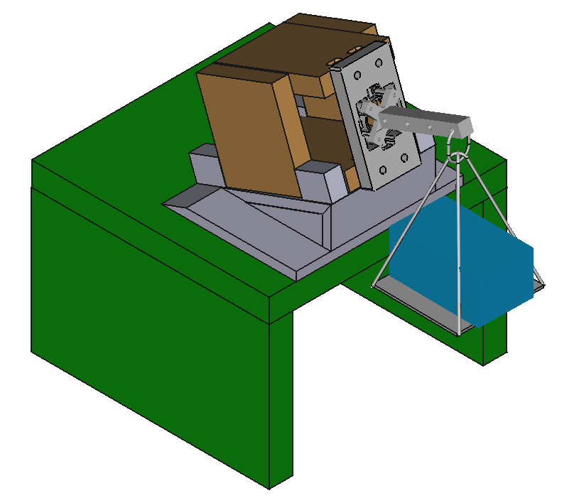

# 3D_Design_portfolio
Work in progress. Presentation of Paulette Pérez' 3D designs.

## [prototipo_cajon_mostrar](prototipo_cajon_mostrar/prototipo_cajon_mostrar.FCStd)

This model is demonstration of the process followed for the calibration of a sensor, part of a research article I'm collaborationg in.

  
the piece ´modelo_placa_sensor_ diseño6_ v7.2.0 v005´ is not of my autoship. It was designed by __ and I adapted my designs to work around it. This model´s highlight is the wedge designed for the wooden box to stay still while giving the sensor two different tilted positions for data points to be obtained. 
